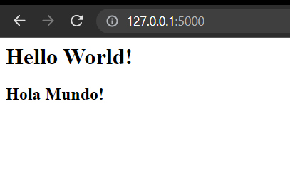

# Flask-OlliResting-Api

Flask es un marco de aplicación web WSGI ligero. Está diseñado para que empezar sea rápido y fácil, con la capacidad de escalar a aplicaciones complejas. Comenzó como un simple envoltorio de Werkzeug y Jinja y se ha convertido en uno de los marcos de aplicaciones web de Python más populares.

En este repositorio se creará una api rest usando el kata gildedrose, además de tenerla dockerizada, estará conectada a una base de datos.

Introducción comandos

- py -m pip install --upgrade pip 
- py -m venv venv
- source venv/scripts/activate

- py -m pip install pytest
- py -m pip install tox
- pip list | grep tox

- pip freeze > requeriments.txt
- python -m pip install -r requirements.txt
- pip install flask-restful
- pip install python-dotenv

## Hello World en Flask

- Se crea el fichero hello.py con la lógica correspondiente 
- Usamos en la terminal set FLASK_APP=hello.py (En Windows)
- Y flask run
- Desde 'http://127.0.0.1:5000/' comprobamos:

## Bibliografía:

Se ha usado https://github.com/dfleta/ollivanders y https://github.com/dfleta/flask-rest-ci-boilerplate como guía y recurso para el trabajo. 